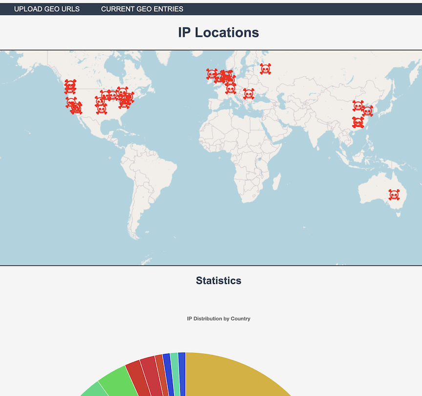

## map IP's by location and put them on a map



# Installation:

## Mongodb is required to store already analyzed IPs

OSX:
```
brew tap mongodb/brew
brew update
brew install mongodb-community@7.0
```

Running:

as a service:
start: 
```
brew services start mongodb-community@7.0
```

stop: 
```
brew services stop mongodb-community@7.0
```

To verify that MongoDB is running, perform one of the following:
If you started MongoDB as a macOS service: `brew services list`

## You'll need to download the geolite2 db to look up IP locations locally:

- Download GeoLite2-City.mmdb from https://github.com/wp-statistics/GeoLite2-City and put in `lib/GeoLite2-City.mmdb`

## Install other Requirements:

`pip install -r requirements.txt`

# Running the main web app:

```
cd WEB
uvicorn main:app --reload
```

Access at http://127.0.0.1:8000

or for access from other machines:

```
uvicorn main:app --host 0.0.0.0 --port 8000 # or whatver port you want
```